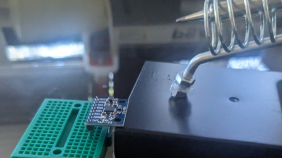
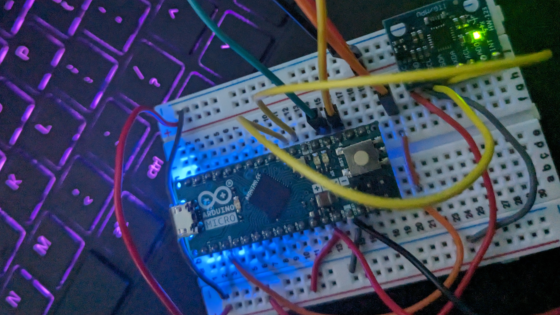
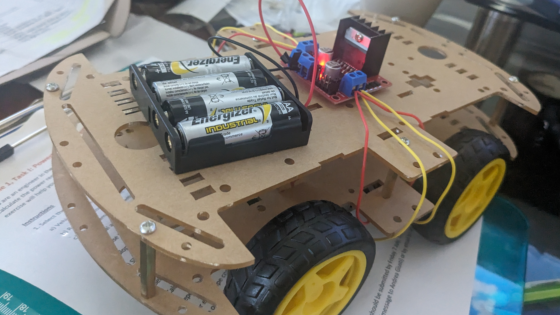
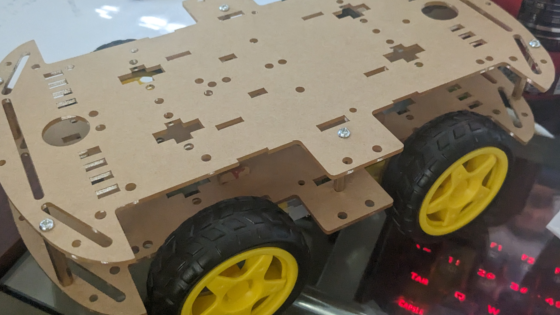
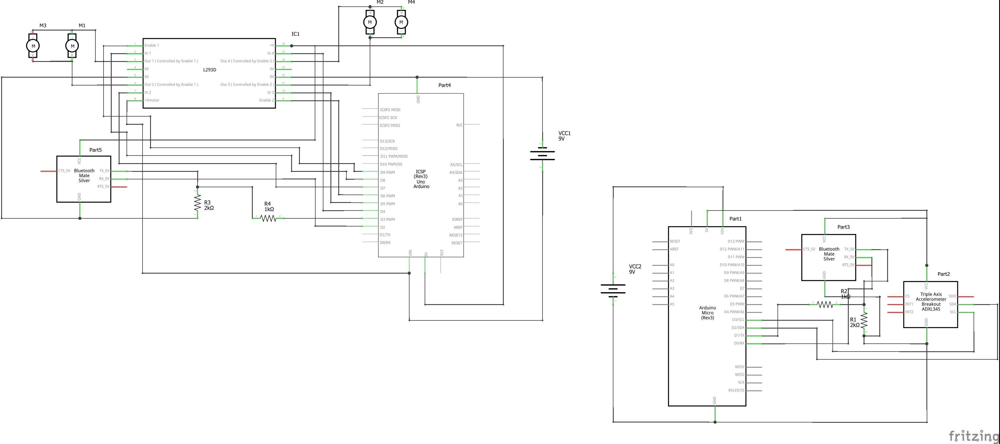

# Gesture Controlled Rover
This is an Arduino four-wheeled rover that is controlled via an accelerometer - hence, gesture controlled. Bluetooth modules on the controller and the rover communicate with each other to send and recieve commands respectively. Ultimately, by tilting the controller, I can make the rover move forwards, backwards, right, left, freeze, and stop. As a modification, I added an ultrasonic distance sensor to prevent head-on collisions with objects. 

| **Engineer** | **School** | **Area of Interest** | **Grade** |
|:--:|:--:|:--:|:--:|
| Zuri Y. | Stanford Online High School | Aerospace Engineering | Incoming Junior

**Replace the BlueStamp logo below with an image of yourself and your completed project. Follow the guide [here](https://tomcam.github.io/least-github-pages/adding-images-github-pages-site.html) if you need help.**


  
# Final Milestone

**Don't forget to replace the text below with the embedding for your milestone video. Go to Youtube, click Share -> Embed, and copy and paste the code to replace what's below.**

<iframe width="560" height="315" src="https://www.youtube.com/embed/F7M7imOVGug" title="YouTube video player" frameborder="0" allow="accelerometer; autoplay; clipboard-write; encrypted-media; gyroscope; picture-in-picture; web-share" allowfullscreen></iframe>

For your final milestone, explain the outcome of your project. Key details to include are:
- What you've accomplished since your previous milestone
- What your biggest challenges and triumphs were at BSE
- A summary of key topics you learned about
- What you hope to learn in the future after everything you've learned at BSE


# Second Milestone

<iframe width="560" height="315" src="https://www.youtube.com/embed/nz1h3VtZ7I8" title="YouTube video player" frameborder="0" allow="accelerometer; autoplay; clipboard-write; encrypted-media; gyroscope; picture-in-picture; web-share" allowfullscreen></iframe>

My second milestone was assembling the bluetooth controller
- This consists of wiring an Arduino Micro, accelerometer, and bluetooth module to a breadboard.
- There is a second bluetooth module on the rover, connected to the Uno. 
- Bluetooth modules will only succesfully sync if both wires connecting to EN are left floating. 
- All commands and wiring that I used/did are in my Milestone 2 video.
- You can keep the controller connected to a port (via the Micro's USB), but I wired it so that it connects to a battery pack instead for convenience.
- Since I am almost done, I will focus on finding stable places to place all my componenets and also start considering modifications. 



Soldering accelerometer




Wired controller


# First Milestone

<iframe width="560" height="315" src="https://www.youtube.com/embed/0JvK0g1WN4c" title="YouTube video player" frameborder="0" allow="accelerometer; autoplay; clipboard-write; encrypted-media; gyroscope; picture-in-picture; web-share" allowfullscreen></iframe>

My first milestone was assembling the rover and getting it to move. 
- This consists of assembling the physical body of the rover, attatching motors, and wiring to the motor driver and Arduino Uno.
- One battery pack was not enough voltage, so I used two.
- I then connected the Arduino Uno and uploaded movement code.
- In the future, I hope to find a neater arrangement for my wires. 



Assembled body of rover




Motors added


# Schematics 


# Code
Here's where you'll put your code. The syntax below places it into a block of code. Follow the guide [here]([url](https://www.markdownguide.org/extended-syntax/)) to learn how to customize it to your project needs. 

```c++
void setup() {
  // put your setup code here, to run once:
  Serial.begin(9600);
  Serial.println("Hello World!");
}

void loop() {
  // put your main code here, to run repeatedly:

}
```

# Bill of Materials

| **Part** | **Note** | **Price** | **Link** |
|:--:|:--:|:--:|:--:|
| Car Chassis Kit | Building the body of the rover (including motors) | $18.99 | <a href="https://www.amazon.com/gp/product/B06VTP8XBQ"> Link </a> |
| Motor Drive Board | Controlling motors | $6.99 | <a href="https://www.amazon.com/Qunqi-Controller-Module-Stepper-Arduino/dp/B014KMHSW6/ref=asc_df_B014KMHSW6/?tag=hyprod-20&linkCode=df0&hvadid=167139094796&hvpos=&hvnetw=g&hvrand=13469222211329594770&hvpone=&hvptwo=&hvqmt=&hvdev=c&hvdvcmdl=&hvlocint=&hvlocphy=9032008&hvtargid=pla-306436938191&psc=1"> Link </a> |
| Arduino ELEGOO Uno | Controlling the rover | $29.99 | <a href="https://www.amazon.com/ELEGOO-Board-ATmega328P-ATMEGA16U2-Compliant/dp/B01EWOE0UU/ref=sr_1_4?crid=3VYFCOYVJKPYP&keywords=arduino+uno&qid=1689707878&s=electronics&sprefix=arduino+uno%2Celectronics%2C147&sr=1-4"> Link </a> |
| Arduino Micro | Controlling the controller | $32.95 | <a href="https://www.amazon.com/Arduino-Micro-Headers-A000053-Controller/dp/B00AFY2S56/ref=sr_1_3?crid=3C1KXL0ILNH38&keywords=arduino+micro&qid=1689707911&s=electronics&sprefix=arduino+micro%2Celectronics%2C140&sr=1-3"> Link </a> |
| Bluetooth Modules | Communicating between rover and controller (need 2 modules) | $13.99 | <a href="https://www.amazon.com/DSD-TECH-HC-05-Pass-through-Communication/dp/B01G9KSAF6/ref=sr_1_4?crid=2O6RMQJSYRT32&keywords=bluetooth+arduino+module&qid=1689708346&s=electronics&sprefix=bluetooth+arduino+module%2Celectronics%2C148&sr=1-4"> Link </a> |
| Digital Accelerometer | For determining how the rover will move | $6.99 | <a href="https://www.amazon.com/SunFounder-Digital-Accelerometer-ADXL345-Raspberry/dp/B0151FIBZO/ref=sr_1_4?crid=323RCVQMEMVE3&keywords=accelerometer+arduino&qid=1689708109&s=electronics&sprefix=accerleromeer+arduino%2Celectronics%2C157&sr=1-4"> Link </a> |
| Breadboards | Solderless circuits | $8.99 | <a href="https://www.amazon.com/DEYUE-Solderless-Prototype-Breadboard-breadboard/dp/B07DMHVC3R/ref=sr_1_3?crid=2QJX1IRWYCNTQ&keywords=breadboards+variety&qid=1689708051&sprefix=breadboards+variety%2Caps%2C165&sr=8-3"> Link </a> |
| Male to Female Dupont Wires | Required for some connections (e.g bluetooth module to breadboard) | $29.99 | <a href="https://www.amazon.com/Elegoo-EL-CP-004-Multicolored-Breadboard-arduino/dp/B01EV70C78/ref=sr_1_5?crid=3MGO0XDTAJCGD&keywords=wires&qid=1689708269&s=electronics&sprefix=wires%2Celectronics%2C180&sr=1-5"> Link </a> |
| Wires | For wiring (assorted) | $9.99 | <a href="https://www.amazon.com/MCIGICM-Breadboard-Jumper-Cables-Arduino/dp/B081GMJVPB/ref=sr_1_5?crid=G7KER5JUHI8D&keywords=wires+arduino&qid=1689708436&s=electronics&sprefix=wires+arduino%2Celectronics%2C145&sr=1-5"> Link </a> |
| Male to Male Wires | For wiring (the stiffer heads are more convenient in some places) | $7.69 | <a href="https://www.amazon.com/RGBZONE-Solderless-Flexible-Breadboard-Raspberry/dp/B07FDY64Q5/ref=sr_1_19?crid=OO6MURICQ1VR&keywords=wires+arduino+with+hard+heads+male+to+male&qid=1689708491&s=electronics&sprefix=wires+arduino+with+hard+heads+male+to+mal%2Celectronics%2C155&sr=1-19"> Link </a> |
| Battery holders | Holding AA batteries | $6.99 | <a href="https://www.amazon.com/Pack-Battery-Holder-Bundle-QTEATAK/dp/B07WY3VMNN/ref=sr_1_3?crid=13EJ8M1PP2AMB&keywords=battery+holder&qid=1689708577&s=electronics&sprefix=battery+holder%2Celectronics%2C151&sr=1-3"> Link </a> |
| AA Batteries | Powering rover and controller | $16.49 | <a href="https://www.amazon.com/AmazonBasics-Performance-Alkaline-Batteries-Count/dp/B00MNV8E0C/ref=sr_1_4?crid=36P1MDLXEIY8E&keywords=AA+batteries&qid=1689708602&s=electronics&sprefix=aa+batterie%2Celectronics%2C143&sr=1-4"> Link </a> |
| Soldering Kit | Used to solder accelerometer pins | $19.99 | <a href="https://www.amazon.com/Soldering-Iron-Kit-Temperature-Desoldering/dp/B07S61WT16/ref=sr_1_8?keywords=soldering+kit&qid=1689708646&sr=8-8"> Link </a> |
| Ultrasonic Distance Sensor | (Modification) Used to sense distance from obstacles | $6.99 | <a href="https://www.amazon.com/WWZMDiB-HC-SR04-Ultrasonic-Distance-Measuring/dp/B0B1MJJLJP/ref=sr_1_4?crid=3QISUM0RVJ7K9&keywords=ultrasonic+distance+sensor&qid=1689708766&sprefix=ultrasonic+distance+sensr%2Caps%2C171&sr=8-4"> Link </a> |

# Other Resources/Examples
One of the best parts about Github is that you can view how other people set up their own work. Here are some past BSE portfolios that are awesome examples. You can view how they set up their portfolio, and you can view their index.md files to understand how they implemented different portfolio components.
- [Example 1](https://trashytuber.github.io/YimingJiaBlueStamp/)
- [Example 2](https://sviatil0.github.io/Sviatoslav_BSE/)
- [Example 3](https://arneshkumar.github.io/arneshbluestamp/)

To watch the BSE tutorial on how to create a portfolio, click here.
